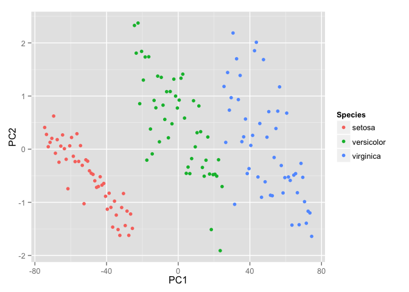

<!-- README.md is generated from README.Rmd. Please edit that file -->
#### allaboutknn is a package intend to prepare your data for conducting k nearest neighbor methods in machine learning.

#### How to install?

``` r
library(devtools)
install_github("weininghu1012/allaboutknn")
```

#### Function1: show\_cluster()

[KNN](https://en.wikipedia.org/wiki/K-nearest_neighbors_algorithm) is a non-parametric method used for classification and regression. The main idea is that we classify similar objects according to euclidean distances. To visualize this, show\_cluster() would give you an example to see how data within same category come together.

``` r
# You might need ggfortify to use the function
library(ggfortify)
```

    ## Loading required package: grid
    ## Loading required package: scales
    ## Loading required package: proto
    ## Loading required package: ggplot2

``` r
library(allaboutknn)
iris = read.csv(file = '/Users/weininghu/Documents/study/ubc2015w1/stat545/dataset/iris.csv',header = TRUE)
show_cluster(iris)
```



#### Function 2: normalize

Why we need to normalize data? Sometimes the data we have may have a really large range.Then in this case, the distance may be dominated by that specific feature. When you normalize, you actually adjust the range of all features, so that distances between variables with larger ranges will not be over-emphasised. There are many ways to scale your data, [click here](https://en.wikipedia.org/wiki/Feature_scaling). A good way to check the data range is calling summary() in R.

``` r
summary(iris)
```

    ##        X           Sepal.Length    Sepal.Width     Petal.Length  
    ##  Min.   :  1.00   Min.   :4.300   Min.   :2.000   Min.   :1.000  
    ##  1st Qu.: 38.25   1st Qu.:5.100   1st Qu.:2.800   1st Qu.:1.600  
    ##  Median : 75.50   Median :5.800   Median :3.000   Median :4.350  
    ##  Mean   : 75.50   Mean   :5.843   Mean   :3.057   Mean   :3.758  
    ##  3rd Qu.:112.75   3rd Qu.:6.400   3rd Qu.:3.300   3rd Qu.:5.100  
    ##  Max.   :150.00   Max.   :7.900   Max.   :4.400   Max.   :6.900  
    ##   Petal.Width          Species  
    ##  Min.   :0.100   setosa    :50  
    ##  1st Qu.:0.300   versicolor:50  
    ##  Median :1.300   virginica :50  
    ##  Mean   :1.199                  
    ##  3rd Qu.:1.800                  
    ##  Max.   :2.500

``` r
# we apply normalize function

normalized_iris = as.data.frame(lapply(iris[1:4], normalize))
summary(normalized_iris)
```

    ##        X         Sepal.Length     Sepal.Width      Petal.Length   
    ##  Min.   :0.00   Min.   :0.0000   Min.   :0.0000   Min.   :0.0000  
    ##  1st Qu.:0.25   1st Qu.:0.2222   1st Qu.:0.3333   1st Qu.:0.1017  
    ##  Median :0.50   Median :0.4167   Median :0.4167   Median :0.5678  
    ##  Mean   :0.50   Mean   :0.4287   Mean   :0.4406   Mean   :0.4675  
    ##  3rd Qu.:0.75   3rd Qu.:0.5833   3rd Qu.:0.5417   3rd Qu.:0.6949  
    ##  Max.   :1.00   Max.   :1.0000   Max.   :1.0000   Max.   :1.0000
